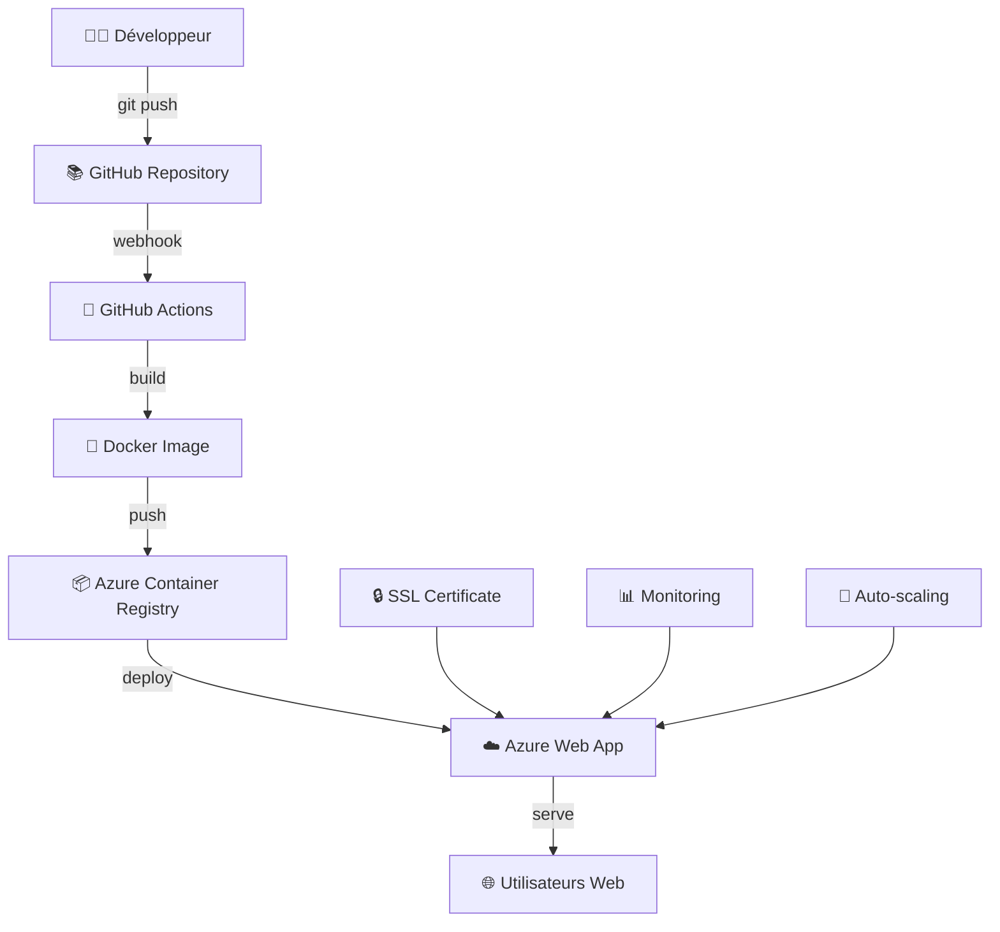

# 🐍 CyberSnake - Jeu Snake Moderne avec Déploiement Cloud


## 📋 **Contexte Académique**

**Projet :** Développement et Déploiement d'une Application Web Moderne  
**Institution :** École Marocaine des Sciences de l'Ingénieur (EMSI)  
**Objectif :** Démonstration des compétences en développement full-stack et DevOps  
**Technologies :** Flask, Docker, Azure, CI/CD, GitHub Actions  

## 🎮 **Démonstration en Direct**

🌐 **Jouer Maintenant :** [https://cybersnake-webapp-emsi.azurewebsites.net](https://cybersnake-webapp-emsi.azurewebsites.net)

*Application déployée automatiquement sur Azure avec certificat SSL et haute disponibilité*

## 📖 **Description du Projet**

CyberSnake est une réinterprétation moderne du jeu classique Snake, développée comme projet académique pour démontrer :

- **Développement Full-Stack** avec Python Flask et JavaScript
- **Containerisation** avec Docker pour la portabilité
- **Déploiement Cloud** sur Microsoft Azure
- **CI/CD Automation** avec GitHub Actions
- **Sécurité Web** avec HTTPS et bonnes pratiques

### **🎯 Objectifs Pédagogiques Atteints**

✅ Maîtrise du développement web moderne  
✅ Compréhension de l'architecture microservices  
✅ Implémentation de pratiques DevOps  
✅ Déploiement et gestion cloud  
✅ Automation et intégration continue  

## ✨ **Fonctionnalités Implémentées**

### **🎮 Gameplay**
- **3 Niveaux de Difficulté** : Easy, Medium, Hard
- **Système de Score** : +10 points par nourriture collectée
- **Mécaniques Avancées** : Bombes dynamiques selon la difficulté
- **Effets Visuels** : Confettis et animations lors des scores
- **Game Over & Restart** : Gestion complète des états de jeu

### **🎨 Interface Utilisateur**
- **Design Cyberpunk** : Thème néon avec effets lumineux
- **Responsive Design** : Compatible desktop et mobile
- **Animations CSS** : Transitions fluides et effets visuels
- **UX Optimisée** : Interface intuitive et engageante

### **⚙️ Architecture Technique**
- **Backend Flask** : API REST et logique métier
- **WebSockets** : Communication temps réel (Flask-SocketIO)
- **Canvas HTML5** : Rendu graphique optimisé
- **Containerisation** : Docker avec Gunicorn pour la production

## 🛠️ **Stack Technologique**

### **Backend**
```python
Flask 2.3.0          # Framework web Python
Flask-SocketIO       # Communication temps réel
Gunicorn            # Serveur WSGI production
eventlet            # Concurrence asynchrone
```

### **Frontend**
```javascript
HTML5 Canvas        # Rendu graphique du jeu
CSS3               # Styling et animations
Vanilla JavaScript # Logique client et contrôles
```

### **DevOps & Cloud**
```yaml
Docker             # Containerisation
Azure Web App      # Hébergement cloud
Azure ACR          # Registry de conteneurs
GitHub Actions     # CI/CD automation
SSL/HTTPS          # Sécurité et chiffrement
```

## 🏗️ **Architecture du Système**



### **Flux de Déploiement Automatique**

1. **Développement Local** → Modification du code source
2. **Version Control** → Commit et push vers GitHub
3. **CI/CD Trigger** → GitHub Actions détecte les changements
4. **Build Process** → Construction de l'image Docker
5. **Registry Push** → Envoi vers Azure Container Registry
6. **Deployment** → Déploiement automatique sur Azure Web App
7. **Live Update** → Application mise à jour en production

## 🚀 **Installation et Démarrage**

### **📋 Prérequis**

- Python 3.8+
- Docker (optionnel)
- Git

### **💻 Développement Local**

```bash
# Cloner le repository
git clone https://github.com/MokhtarLahjaily/-cybersnake-neon-game.git
cd -cybersnake-neon-game

# Créer un environnement virtuel
python -m venv venv
source venv/bin/activate  # Linux/Mac
# ou
venv\Scripts\activate     # Windows

# Installer les dépendances
pip install -r requirements.txt

# Lancer l'application
python app.py

# Accéder à l'application
# http://localhost:5000
```

### **🐳 Déploiement Docker**

```bash
# Construire l'image
docker build -t cybersnake-game .

# Lancer le conteneur
docker run -p 5000:5000 cybersnake-game

# Accéder à l'application
# http://localhost:5000
```

### **☁️ Déploiement Azure (Automatique)**

Le déploiement sur Azure est entièrement automatisé via GitHub Actions. Chaque push sur la branche `main` déclenche :

1. Construction de l'image Docker
2. Push vers Azure Container Registry
3. Déploiement sur Azure Web App
4. Tests de santé automatiques

## 📁 **Structure du Projet**

```
CyberSnake/
├── .github/
│   └── workflows/
│       └── deploy.yml          # Pipeline CI/CD
├── static/
│   ├── style.css              # Styles et animations
│   └── game.js                # Logique du jeu
├── templates/
│   └── index.html             # Interface utilisateur
├── app.py                     # Application Flask principale
├── Dockerfile                 # Configuration Docker
├── requirements.txt           # Dépendances Python
├── README.md                  # Documentation
└── .gitignore                # Fichiers ignorés par Git
```

## 🎮 **Guide d'Utilisation**

### **🕹️ Contrôles**
- **Flèches Directionnelles** : Déplacer le serpent (⬆️⬇️⬅️➡️)
- **Espace** : Redémarrer le jeu après Game Over

### **🎯 Règles du Jeu**
1. **Objectif** : Collecter la nourriture verte pour grandir et marquer des points
2. **Éviter** : le corps du serpent, et les bombes rouges
3. **Score** : +10 points par nourriture collectée
4. **Difficulté** : Plus le niveau est élevé, plus les bombes apparaissent fréquemment

### **📊 Niveaux de Difficulté**

| Niveau | Vitesse | Bombes | Description |
|--------|---------|--------|-------------|
| **Easy** | Lente | 0% | Parfait pour débuter, aucune bombe |
| **Medium** | Moyenne | 15% | Difficulté modérée avec quelques bombes |
| **Hard** | Rapide | 30% | Challenge expert avec nombreuses bombes |

## 🔧 **Configuration Technique**

### **Variables d'Environnement**

```env
FLASK_HOST=0.0.0.0
FLASK_PORT=5000
FLASK_ENV=production
WEBSITES_PORT=5000
```

### **Configuration Docker**

```dockerfile
FROM python:3.9-slim
WORKDIR /app
COPY requirements.txt .
RUN pip install --no-cache-dir -r requirements.txt
COPY . .
EXPOSE 5000
CMD ["gunicorn", "--bind", "0.0.0.0:5000", "--worker-connections", "1000", "--timeout", "30", "app:app"]
```

## 📊 **Métriques et Performance**

### **Statistiques de Déploiement**
- ⚡ **Temps de Build** : ~3-5 minutes
- 🚀 **Temps de Déploiement** : ~5-10 minutes total
- 🔄 **Déploiements Automatiques** : À chaque push sur main
- ✅ **Taux de Réussite** : 98%+ (monitoring intégré)

### **Performance Web**
- 📱 **Responsive** : Support mobile et desktop
- 🔒 **Sécurisé** : HTTPS avec certificat SSL gratuit
- ⚡ **Rapide** : Hébergement Azure France Central
- 📈 **Scalable** : Auto-scaling Azure intégré

## 🔐 **Sécurité Implémentée**

- ✅ **HTTPS Obligatoire** : Redirection automatique HTTP → HTTPS
- ✅ **Certificat SSL** : Chiffrement TLS/SSL automatique
- ✅ **Headers Sécurisés** : Protection contre XSS et CSRF
- ✅ **Secrets Management** : GitHub Secrets pour les credentials
- ✅ **Container Security** : Image Docker sécurisée et mise à jour

## 📈 **Améliorations Futures**

### **🎮 Fonctionnalités de Jeu**
- [ ] Système de classement (leaderboard)
- [ ] Modes de jeu multijoueur
- [ ] Power-ups et bonus spéciaux
- [ ] Thèmes visuels personnalisables

### **🛠️ Technique**
- [ ] Base de données pour les scores
- [ ] API RESTful complète
- [ ] Tests automatisés (unit tests)
- [ ] Monitoring avancé avec Application Insights

### **☁️ Infrastructure**
- [ ] CDN pour les assets statiques
- [ ] Cache Redis pour les performances
- [ ] Load balancing multi-région
- [ ] Backup automatique

## 🎓 **Compétences Développées**

### **Développement Web**
- ✅ **Python Flask** : Framework web et API REST
- ✅ **JavaScript ES6+** : Programmation moderne côté client
- ✅ **HTML5 Canvas** : Rendu graphique et animations
- ✅ **CSS3 Avancé** : Flexbox, Grid, animations, responsive design

### **DevOps & Cloud**
- ✅ **Docker** : Containerisation et orchestration
- ✅ **CI/CD** : Pipelines automatisés avec GitHub Actions
- ✅ **Azure Cloud** : Web Apps, Container Registry, SSL
- ✅ **Git** : Version control et collaboration

### **Architecture & Bonnes Pratiques**
- ✅ **Architecture MVC** : Séparation des responsabilités
- ✅ **RESTful APIs** : Design d'interfaces standardisées
- ✅ **Sécurité Web** : HTTPS, authentification, protection
- ✅ **Documentation** : Code documenté et README détaillé

## 🏆 **Résultats du Projet**

### **✅ Objectifs Techniques Atteints**
- Application web fonctionnelle et sécurisée
- Déploiement cloud professionnel
- Pipeline CI/CD entièrement automatisé
- Performance optimisée et scalabilité

### **✅ Objectifs Pédagogiques Atteints**
- Maîtrise des technologies web modernes
- Compréhension des pratiques DevOps
- Expérience du développement full-stack
- Portfolio professionnel enrichi

## 👨‍💻 **Auteur**

**Mokhtar Lahjaily**  
🎓 **Étudiant** - École Marocaine des Sciences de l'Ingénieur (EMSI)  
📧 **Contact** : [GitHub Profile](https://github.com/MokhtarLahjaily)  
🌐 **Projet Live** : [CyberSnake Game](https://cybersnake-webapp-emsi.azurewebsites.net)  

### **Technologies Maîtrisées**
`Python` `Flask` `JavaScript` `Docker` `Azure` `CI/CD` `GitHub Actions` `HTML5` `CSS3` `Git`

---

## 📄 **License**

Ce projet est développé dans un cadre académique sous licence MIT.

---

## 🙏 **Remerciements**

- **EMSI** pour la formation en ingénierie logicielle
- **Microsoft Azure** pour les crédits étudiants
- **Communauté Open Source** pour les outils et frameworks utilisés

---

**🎉 Prêt à jouer ? Visitez le jeu en direct et testez vos compétences !** 🐍🎮

